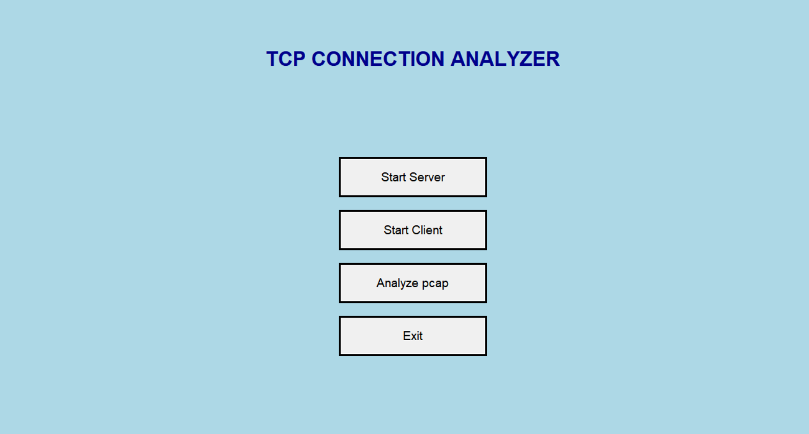

# TCP Packet Analyzer with Client-Server and PCAP File Integration

## Overview
This project is a **TCP Packet Analyzer** designed to:
- Analyze TCP **three-way handshake** (SYN, SYN-ACK, ACK) during client-server communication.
- Provide a graphical user interface (GUI) to simulate and analyze TCP connections.
- Integrate **Scapy** for real-time packet sniffing (optional).
- Allow users to load and analyze **PCAP files** (captured via Wireshark or Scapy) to inspect all TCP messages.

This tool is ideal for understanding and visualizing TCP communications, including 3-way handshakes, and analyzing packet details in both real-time and offline modes.

---

## Features
1. **Client-Server TCP Handshake Analysis**:
   - GUI-based simulation of a TCP three-way handshake (SYN, SYN-ACK, ACK).
   - Logging and visualization of handshake completion.

2. **PCAP File Analyzer**:
   - Load and analyze TCP messages from a saved PCAP file.

3. **Real-Time Packet Sniffing** (Optional):
   - Utilize **Scapy** to sniff TCP packets in real-time.
   - Eliminates the need for Wireshark for live packet analysis.

4. **User-Friendly Interface**:
   - Interactive GUI for both client-server and packet analysis tools.
   - Easy-to-use buttons for starting/stopping sniffing and loading files.

---

## Requirements
Ensure the following software is installed on your machine:

1. **Python** (>= 3.8)
2. Python Libraries:
   - `tkinter` (for GUI)
   - `scapy` (for packet sniffing)
   - `pyshark` (for PCAP file analysis)
3. Wireshark (optional, for capturing PCAP files if Scapy is not used)

Install required Python libraries using:
```bash
pip install scapy pyshark
```
## How to use
1. **Clone the repository**
```bash
git clone https://github.com/KrishnenduMR/TCP-Connection-Analyzer.git
cd TCP-Connection-Analyzer
cd src
```
2. **Open wireshark**
- Select appropriate network interface
- Filter the connection using 
```bash
tcp.port == <port>
```
- Start capturing

3. **Run the main app**
```bash
python main.py
```
- Start server
- Start client
- Communicate between client and server
- Close connection
- Exit the tab

4. **Stop capturing in wireshark**
- file -> save as -> filename.pcap

5. **open pcap analyzer**
- Select the pcap file
- View details

6. **Connection analyze using scapy**(optional)
- Select scapy analyzer
- Start capturing
- View details
- Stop capturing

## project structure

Documents/
└── src/
    ├── __pycache__/
    ├── analyzer.py
    ├── client.py
    ├── main.py
    ├── server.py
    └── usingscapy.py
README.md


## Key Functionalities

### Three-Way Handshake:
- Log SYN, SYN-ACK, and ACK packets between client and server.

### PCAP Analysis:
- Extract all TCP packets from a PCAP file, including non-handshake messages.

### Real-Time Packet Sniffing:
- Monitor live traffic for SYN, SYN-ACK, ACK, FIN, or custom TCP packets.

---

## App Front Page



## Security Notes
- Avoid sharing captured **PCAP files** into public as they may contain sensitive data.
- Ensure Scapy sniffing runs with appropriate privileges (e.g., `sudo` on Linux).

---
## 📄 License
This project is licensed under the **MIT License**.


